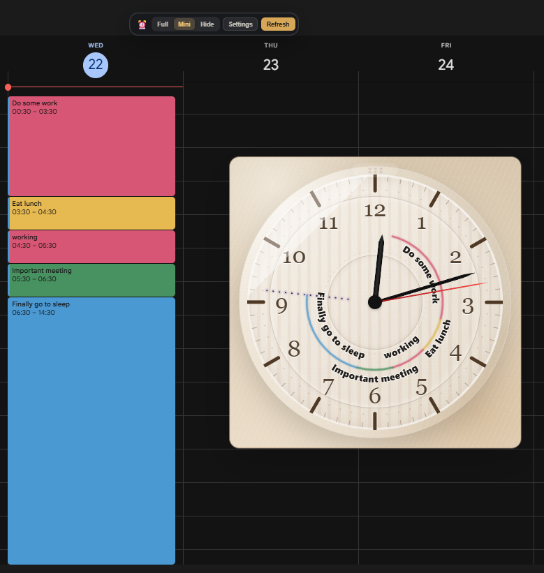

# Calendar Clock Chrome Extension

### More clock-face designs

  
  

<em>Dark 24-hour design (left) and light 12-hour design (right).</em>

### Calendar view

> **Chrome Web Store status:** Calendar Clock is currently awaiting review. Until the store listing is approved, you can install the extension manually:
>
> 1. Download or clone this repository.
> 2. Open `chrome://extensions` in Google Chrome.
> 3. Enable **Developer mode** in the top-right corner.
> 4. Click **Load unpacked**.
> 5. Select the downloaded `calendar-clock` folder.
> 6. Open or refresh [Google Calendar](https://calendar.google.com/). Pin extension to the toolbar and click the icon to open the snapshot popup. Enable access to site if needed.

Privacy: see [Privacy Policy](Privacy%20Policy.md).

This repo contains a Manifest V3 Chrome extension.

## Built with Codex and GPT-5.6

Calendar Clock was built during OpenAI Build Week with Codex and GPT-5.6, primarily using the Sol model across a variety of reasoning levels.

- Codex turned an initial single-page HTML clock prototype into a modular Manifest V3 extension and helped separate the overlay, background service, event pipeline, clock faces, reminders, and time projection into focused components.
- A dedicated Chrome for Testing profile and Browser Harness let Codex work on the same live Google Calendar page as the developer: inspecting the DOM and page-owned structured sync data, creating deterministic fixture schedules, reproducing bugs, and checking the visible result after each fix.
- Codex created regression checks for time-window projection, overlapping and overnight events, deleted and cached events, refresh behavior, stable event colors, privacy-safe diagnostics, and reminder storage and playback.
- GPT-5.6 helped reason through Calendar's changing data and DOM behavior, event-lane layout, cross-week caching, and the modular architecture. Key decisions included keeping captured data local, preferring structured page-owned data with a resilient DOM fallback, and making clock-face modules independently removable.

The toolbar icon opens a snapshot popup for the latest stored Calendar Clock data. On `calendar.google.com`, Calendar Clock watches the structured sync data already loaded by the page and falls back to visible event chips when that data is unavailable. It stores the resulting event ranges in `chrome.storage.local`; the clock turns them into arcs.

After the Google Calendar content script has added the overlay, use its floating panel to move controls around the page, open full clock view, switch to mini view, hide the clock, refresh events, toggle the Past/Future Divider, open debug, and choose which 12-hour span the arcs represent, such as `08:00-20:00` or `20:00-08:00`.

## Key features

- **12-hour and 24-hour modes:** Use a familiar 12-hour clock or see the entire day on one 24-hour dial. The dark design above shows the 24-hour mode.
- **Multiple clock-face designs:** Switch between light, dark, and themed faces without changing your calendar.
- **Events at a glance:** See event duration, color, and overlaps directly as arcs on the clock.
- **Flexible display:** Use full or mini mode, move the clock around the page, or hide it when you do not need it.
- **Smart time window:** Follow the current hour, fit the view around your events, or jump to an event outside the visible range.
- **Local by design:** Captured calendar data stays in your browser.

Notes:

- For the visual-text fallback, keep Google Calendar in day or week view where event chips include visible time labels.
- Google Calendar DOM classes and its internal sync response format are not stable APIs. The fallback uses broader accessibility attributes such as `aria-label`, `title`, and common event data attributes.

---

## My other projects

- [AivoRelay: AI Voice Relay for Windows](https://github.com/MaxITService/AIVORelay)
- [OneClickPrompts: Your Quick Prompt Companion for Multiple AI Chats!](https://github.com/MaxITService/OneClickPrompts)
- [AI for Complete Beginners: Guide to LLMs](https://medium.com/@maxim.fomins/ai-for-complete-beginners-guide-llms-f19c4b8a8a79)
