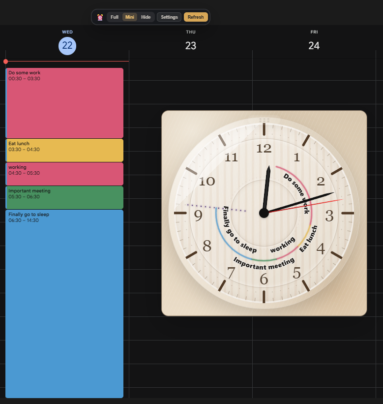

# Calendar Clock Chrome Extension

### More clock-face designs

  
  

<em>Dark 24-hour design (left) and light 12-hour design (right).</em>

### Calendar view

> **Chrome Web Store status:** Calendar Clock is currently awaiting review. Until the store listing is approved, you can install the extension manually:
>
> 1. Download or clone this repository.
> 2. Open `chrome://extensions` in Google Chrome.
> 3. Enable **Developer mode** in the top-right corner.
> 4. Click **Load unpacked**.
> 5. Select the downloaded `calendar-clock` folder.
> 6. Open or refresh [Google Calendar](https://calendar.google.com/) or [Outlook Calendar](https://outlook.live.com/calendar/view/workweek). Pin the extension and click its icon to open the snapshot popup. Enable site access if needed.

Privacy: see [Privacy Policy](Privacy%20Policy.md).

This repo contains a Manifest V3 Chrome extension.

## Key features

- **12-hour and 24-hour modes:** Use a familiar 12-hour clock or see the entire day on one 24-hour dial. The dark design above shows the 24-hour mode.
- **Multiple clock-face designs:** Switch between light, dark, and themed faces without changing your calendar.
- **Events at a glance:** See event duration, color, and overlaps directly as arcs on the clock.
- **Flexible display:** Use full or mini mode, move or resize the mini clock with remembered geometry, or hide it when you do not need it.
- **Smart time window:** Follow the current hour, fit the view around your events, or jump to an event outside the visible range.
- **Local by design:** Captured calendar data stays in your browser.
- **Google and Outlook:** Keep independent snapshots and choose either calendar in the toolbar popup.

Notes:

- For the visual-text fallback, use a day or week-style view where event chips include readable time labels.
- Calendar page internals are not stable APIs. The fallback uses accessibility attributes and stable item data attributes where available.

---

## My other projects

- [AivoRelay: AI Voice Relay for Windows](https://github.com/MaxITService/AIVORelay)
- [OneClickPrompts: Your Quick Prompt Companion for Multiple AI Chats!](https://github.com/MaxITService/OneClickPrompts)
- [AI for Complete Beginners: Guide to LLMs](https://medium.com/@maxim.fomins/ai-for-complete-beginners-guide-llms-f19c4b8a8a79)
